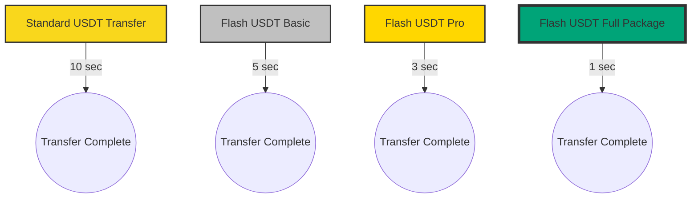
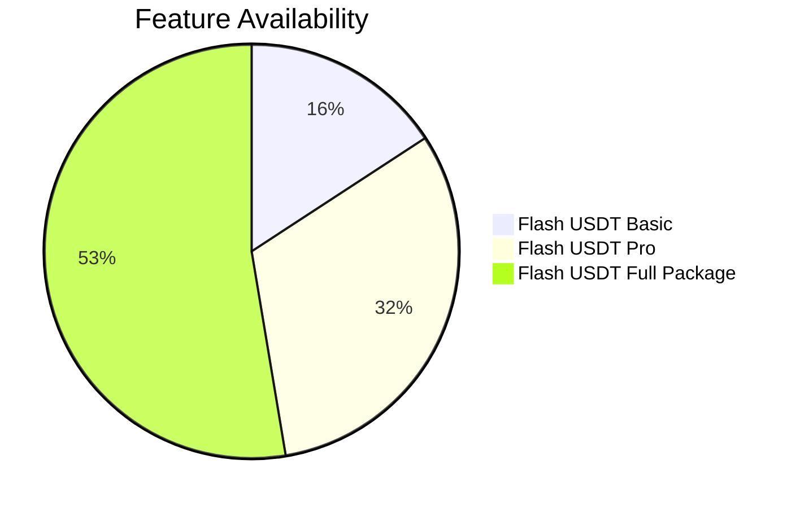
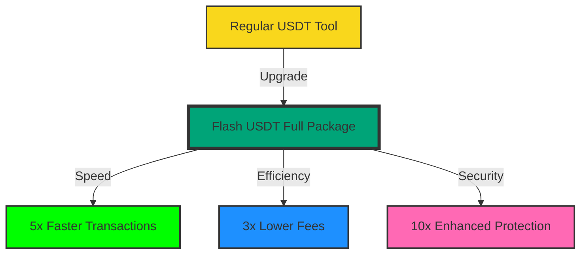

# Flash-USDT-integrated-also-with-Gf-Flash-BTC-
Flash USDT Gateway is a USDT flashing software that lets users perform BTC and USDT flashing transactions with multiple variants of Bitcoin (including Bitcoin Fantom and Wrapped Bitcoin) and USDT (ERC20, BEP20, and TRC20). This software application exists solely as a proof of concept solution, and i am not responsible for the illegal use of it.
<div align="center">

# ⚡️ Flash USDT Ecosystem 💎


### 🚀 Revolutionize Your Crypto Experience with Lightning-Fast Solutions 🌐

[✨ Features](#-features) • [💼 Products & Pricing](#-products--pricing) • [📊 Performance](#-performance) • [🚀 Quick Start](#-quick-start) • [🛟 Support](#-support) • [🤝 Community](#-community)

<br>

[](https://scripters.shop/product/flash-usdt-full-package/?v=402f03a963ba#reviews)
[](https://scripters.shop/product/flash-usdt-full-package/?v=402f03a963ba#reviews)

</div>

## 🌟 Features

<table>
  <tr>
    <td align="center"><br><b>Lifetime Updates</b></td>
    <td align="center"><br><b>Compact Size</b></td>
    <td align="center"><br><b>Multi-Platform</b></td>
    <td align="center"> <br><b>Global Access</b></td>
</td>
  </tr>
  <tr>
    <td align="center">Stay cutting-edge</td>
    <td align="center">Optimized at 119 MB</td>
    <td align="center">Windows, Mac, Android, Linux</td>
    <td align="center">Worldwide availability</td>
  </tr>
</table>

## 💼 Products & Pricing

<div align="center">

| Product | One-Time Price | Monthly Subscription | Annual Subscription | Features |
|---------|----------------|----------------------|---------------------|----------|
| 🥈 Flash USDT Basic | $500 | $50/month | $500/year | Essential features for beginners |
| 🥇 Flash USDT Pro | $1150 | $85/month | $1150/year | Advanced tools for experienced users |
| 💎 Flash USDT Full Package | ~~$550~~ $1800 | $200/month | $1800/year | Complete suite with priority support |
| 🚀 Flash Bitcoin Tool | $4000 | $400/month | $4000/year | Specialized Bitcoin transactions |

[🛒 Shop Now](https://T.me/orteldev)

</div>

## 📊 Performance

### Transaction Speed Comparison



### Feature Comparison



## 🚀 Quick Start

1. 📥 Choose and [download](https://T.me/orteldev) your preferred Flash USDT package.
2. 🔑 Activate with your unique code (provided upon purchase).
3. 🖥️ Install on your device (compatible with Windows/Mac/Android/Linux).
4. 💸 Start enjoying lightning-fast crypto transactions!
5. 
## 📊 Performance Boost



## 🛟 24/7 Expert Support

<div align="center">

[📧 Email](mailto:ds3183452@gmail.com) • [💬 Live Chat](https://T.me/orteldev) • [📚 Documentation](https://T.me/orteldev)

</div>

## 🤝 Community

- 🤖 **Telegram:** [Join Our Chat](https://t.me/orteldev)
- 🍃 **Author Updates:** [Follow Here](https://t.me/orteldev)
# Support Our Vision

Help us push the boundaries of crypto technology!

**Donation Address (Multi-Chain Compatible):** 
```

```

🔗 **Contribute:** [Donate Here](https://T.me/orteldev)

## ⚠️ Disclaimer

<div align="center">

Our products are designed for legitimate use within the bounds of applicable laws and regulations. Users are responsible for ensuring compliance in their jurisdiction.

</div>

<div align="center">

### 💎 Elevate Your Crypto Game with Flash USDT Ecosystem! 💎


</div>
Last updated: Wed jan 14 05:15:10 UTC 2025
Last updated: Wed Aug 14 06:21:13 UTC 2024
Last updated: Wed Aug 14 07:14:06 UTC 2024
Last updated: Wed Aug 14 08:19:15 UTC 2024
Last updated: Wed Aug 14 09:16:13 UTC 2024
Last updated: Wed Aug 14 10:16:22 UTC 2024
Last updated: Wed Aug 14 11:13:31 UTC 2024
Last updated: Wed Aug 14 12:29:49 UTC 2024
Last updated: Wed Aug 14 13:18:42 UTC 2024
Last updated: Wed Aug 14 14:14:33 UTC 2024
Last updated: Wed Aug 14 15:15:44 UTC 2024
Last updated: Wed Aug 14 16:21:38 UTC 2024
Last updated: Wed Aug 14 17:13:08 UTC 2024
Last updated: Wed Aug 14 18:19:59 UTC 2024
Last updated: Wed Aug 14 19:13:44 UTC 2024
Last updated: Wed Aug 14 20:15:47 UTC 2024
Last updated: Wed Aug 14 21:14:03 UTC 2024
Last updated: Wed Aug 14 22:15:10 UTC 2024
Last updated: Thu Aug 15 02:21:29 UTC 2024
Last updated: Thu Aug 15 04:17:37 UTC 2024
Last updated: Thu Aug 15 05:15:10 UTC 2024
Last updated: Thu Aug 15 06:21:21 UTC 2024
Last updated: Thu Aug 15 07:13:49 UTC 2024
Last updated: Thu Aug 15 08:19:14 UTC 2024
Last updated: Thu Aug 15 10:17:56 UTC 2024
Last updated: Thu Sep 19 20:15:00 UTC 2024
Last updated: Thu Sep 19 21:13:26 UTC 2024
Last updated: Thu Sep 19 22:13:18 UTC 2024
Last updated: Thu Sep 19 23:14:44 UTC 2024
Last updated: Fri Sep 20 01:06:47 UTC 2024
Last updated: Fri Sep 20 02:42:54 UTC 2024
Last updated: Fri Sep 20 03:17:14 UTC 2024
Last updated: Fri Sep 20 04:17:17 UTC 2024
Last updated: Fri Sep 20 05:14:13 UTC 2024
Last updated: Fri Sep 20 06:20:11 UTC 2024
Last updated: Fri Sep 20 07:14:07 UTC 2024
Last updated: Fri Sep 20 08:18:35 UTC 2024
Last updated: Fri Sep 20 09:18:48 UTC 2024
Last updated: Fri Sep 20 10:15:33 UTC 2024
Last updated: Fri Sep 20 11:12:27 UTC 2024
Last updated: Fri Sep 20 12:28:07 UTC 2024
Last updated: Fri Sep 20 13:20:41 UTC 2024
Last updated: Fri Sep 20 14:13:51 UTC 2024
Last updated: Fri Sep 20 15:14:59 UTC 2024
Last updated: Fri Sep 20 16:17:39 UTC 2024
Last updated: Fri Sep 20 17:12:20 UTC 2024
Last updated: Fri Sep 20 18:19:05 UTC 2024
Last updated: Fri Sep 20 19:12:14 UTC 2024
Last updated: Fri Sep 20 20:16:16 UTC 2024
Last updated: Fri Sep 20 21:13:16 UTC 2024
Last updated: Fri Sep 20 22:14:44 UTC 2024
Last updated: Fri Sep 20 23:13:40 UTC 2024
Last updated: Sat Sep 21 01:05:38 UTC 2024
Last updated: Sat Sep 21 02:40:18 UTC 2024
Last updated: Sat Sep 21 03:15:27 UTC 2024
Last updated: Sat Sep 21 04:16:47 UTC 2024
Last updated: Sat Sep 21 05:13:24 UTC 2024
Last updated: Sat Sep 21 06:18:44 UTC 2024
Last updated: Sat Sep 21 07:12:43 UTC 2024
Last updated: Sat Sep 21 08:16:45 UTC 2024
Last updated: Sat Sep 21 09:13:30 UTC 2024
Last updated: Sat Sep 21 10:13:25 UTC 2024
Last updated: Sat Sep 21 11:10:42 UTC 2024
Last updated: Sat Sep 21 13:17:17 UTC 2024
Last updated: Sat Sep 21 14:11:44 UTC 2024
Last updated: Sat Sep 21 15:14:56 UTC 2024
Last updated: Sat Sep 21 16:17:43 UTC 2024
Last updated: Sat Sep 21 17:13:44 UTC 2024
Last updated: Sat Sep 21 18:17:48 UTC 2024
Last updated: Sat Sep 21 19:10:17 UTC 2024
Last updated: Sat Sep 21 21:12:15 UTC 2024
Last updated: Sat Sep 21 22:12:47 UTC 2024
Last updated: Sat Sep 21 23:12:57 UTC 2024
Last updated: Sun Sep 22 01:13:20 UTC 2024
Last updated: Sun Sep 22 02:50:13 UTC 2024
Last updated: Sun Sep 22 03:20:35 UTC 2024
Last updated: Sun Sep 22 04:19:13 UTC 2024
Last updated: Sun Sep 22 05:13:56 UTC 2024
Last updated: Sun Sep 22 06:18:45 UTC 2024
Last updated: Sun Sep 22 08:16:48 UTC 2024
Last updated: Sun Sep 22 09:13:42 UTC 2024
Last updated: Sun Sep 22 10:14:02 UTC 2024
Last updated: Sun Sep 22 11:10:57 UTC 2024
Last updated: Sun Sep 22 12:26:10 UTC 2024
Last updated: Sun Sep 22 13:17:11 UTC 2024
Last updated: Sun Sep 22 14:12:10 UTC 2024
Last updated: Sun Sep 22 15:13:11 UTC 2024
Last updated: Sun Sep 22 16:16:08 UTC 2024
Last updated: Sun Sep 22 17:12:30 UTC 2024
Last updated: Sun Sep 22 18:17:43 UTC 2024
Last updated: Sun Sep 22 19:10:49 UTC 2024
Last updated: Sun Sep 22 20:14:49 UTC 2024
Last updated: Sun Sep 22 21:12:28 UTC 2024
Last updated: Sun Sep 22 22:13:53 UTC 2024
Last updated: Sun Sep 22 23:14:53 UTC 2024
Last updated: Mon Sep 23 01:08:56 UTC 2024
Last updated: Mon Sep 23 02:46:57 UTC 2024
Last updated: Mon Sep 23 03:19:46 UTC 2024
Last updated: Mon Sep 23 04:17:35 UTC 2024
Last updated: Mon Sep 23 06:21:05 UTC 2024
Last updated: Mon Sep 23 07:14:19 UTC 2024
Last updated: Mon Sep 23 08:19:14 UTC 2024
Last updated: Mon Sep 23 09:17:33 UTC 2024
Last updated: Mon Sep 23 10:16:57 UTC 2024
Last updated: Mon Sep 23 11:11:54 UTC 2024
Last updated: Mon Sep 23 12:29:10 UTC 2024
Last updated: Mon Sep 23 13:22:42 UTC 2024
Last updated: Mon Sep 23 14:13:41 UTC 2024
Last updated: Mon Sep 23 15:15:32 UTC 2024
Last updated: Mon Sep 23 16:17:33 UTC 2024
Last updated: Mon Sep 23 17:12:46 UTC 2024
Last updated: Mon Sep 23 18:19:34 UTC 2024
Last updated: Mon Sep 23 19:11:45 UTC 2024
Last updated: Mon Sep 23 20:17:09 UTC 2024
Last updated: Mon Sep 23 21:13:21 UTC 2024
Last updated: Mon Sep 23 22:14:25 UTC 2024
Last updated: Mon Sep 23 23:13:43 UTC 2024
Last updated: Tue Sep 24 01:09:21 UTC 2024
Last updated: Tue Sep 24 02:46:56 UTC 2024
Last updated: Tue Sep 24 03:19:52 UTC 2024
Last updated: Tue Sep 24 04:18:01 UTC 2024
Last updated: Tue Sep 24 06:20:53 UTC 2024
Last updated: Tue Sep 24 07:14:04 UTC 2024
Last updated: Tue Sep 24 09:16:10 UTC 2024
Last updated: Tue Sep 24 10:15:22 UTC 2024
Last updated: Tue Sep 24 12:29:41 UTC 2024
Last updated: Tue Sep 24 13:22:29 UTC 2024
Last updated: Tue Sep 24 14:12:45 UTC 2024
Last updated: Tue Sep 24 16:18:24 UTC 2024
Last updated: Tue Sep 24 17:13:18 UTC 2024
Last updated: Tue Sep 24 18:19:32 UTC 2024
Last updated: Tue Sep 24 19:11:59 UTC 2024
Last updated: Tue Sep 24 20:16:25 UTC 2024
Last updated: Tue Sep 24 21:13:01 UTC 2024
Last updated: Tue Sep 24 23:13:38 UTC 2024
Last updated: Wed Sep 25 01:10:10 UTC 2024
Last updated: Wed Sep 25 02:48:40 UTC 2024
Last updated: Wed Sep 25 03:21:58 UTC 2024
Last updated: Wed Sep 25 04:18:13 UTC 2024
Last updated: Wed Sep 25 05:14:45 UTC 2024
Last updated: Wed Sep 25 06:20:37 UTC 2024
Last updated: Wed Sep 25 07:14:43 UTC 2024
Last updated: Wed Sep 25 08:20:22 UTC 2024
Last updated: Wed Sep 25 09:16:10 UTC 2024
Last updated: Wed Sep 25 10:16:57 UTC 2024
Last updated: Wed Sep 25 11:12:56 UTC 2024
Last updated: Wed Sep 25 12:29:21 UTC 2024
Last updated: Wed Sep 25 14:14:37 UTC 2024
Last updated: Wed Sep 25 15:15:41 UTC 2024
Last updated: Wed Sep 25 16:20:20 UTC 2024
Last updated: Wed Sep 25 17:13:12 UTC 2024
Last updated: Wed Sep 25 18:19:37 UTC 2024
Last updated: Wed Sep 25 19:10:22 UTC 2024
Last updated: Wed Sep 25 20:16:11 UTC 2024
